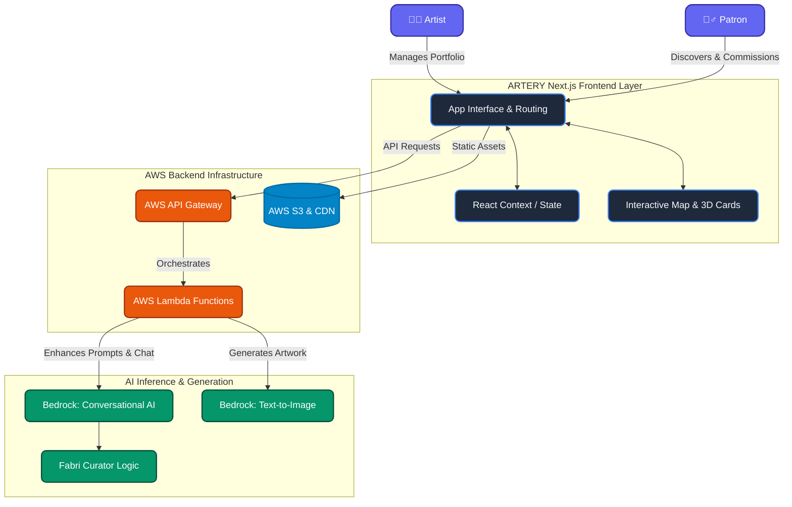

# 🎨 ARTERY: Helping you pump that art in your blood

> An AI-powered art marketplace connecting art patrons with Indian artisans while providing intelligent curation and AI-generated artwork capabilities.

<br/>

## 🌟 Overview

The traditional art market faces significant inefficiencies—from discovery gaps and geographic barriers to commission complexity. **ARTERY** solves these problems by bridging the gap between Indian artisans and art patrons through an intelligent, AI-enhanced platform. 

Whether you are an **Art Patron** seeking custom, culturally-rich artwork or an **Artist** looking for regional exposure and streamlined commission management, ARTERY provides a powerful dual-experience.

<br/>

## ✨ Key Features

- 🎭 **Dual User Experience**: Separate, tailored interfaces for Patrons (discovery and commissioning) and Artists (portfolio management and sales tracking).
- 🔍 **Intelligent Artist Discovery**: Browse creators through beautiful grid or interactive map views. Filter by location, medium, and style.
- 🖼️ **AI-Powered Art Generation**: Create custom artwork on-the-fly using text prompts via Amazon Bedrock, with support for formats like Canvas, Saree, Wallpaper, and Tote Bag.
- 🤖 **Fabri - The AI Curator**: A conversational AI assistant that understands your style preferences, providing personalized recommendations and contextual art education.
- 🛒 **Streamlined Commissions**: Simplified end-to-end workflow for requesting custom artwork, complete with dynamic pricing, framing options, and a seamless checkout experience.

<br/>

## 🏗 System Architecture

ARTERY leverages a modern, serverless architecture optimized for high performance, utilizing Next.js on the frontend and AWS native services for its AI capabilities.



<br/>

## 🗺️ User Journey & Data Flow

The platform handles complex AI interactions natively while ensuring the user remains deeply immersed in the artistic experience.

```mermaid
sequenceDiagram
    autonumber
    actor Patron as 🙎‍♂️ Patron
    participant UI as 🖥️ Next.js Client
    participant API as 🚪 AWS API Gateway
    participant AI as 🧠 Amazon Bedrock
    
    Patron->>UI: Browses Regional Artists
    UI-->>Patron: Renders Interactive Map & Portfolios
    
    rect rgb(30, 41, 59)
    Note over Patron,AI: Contextual AI Assistance
    Patron->>UI: Asks Fabri for Recommendations
    UI->>API: Sends Chat Thread + Art Context
    API->>AI: Invokes Foundation Text Model
    AI-->>API: Returns Formatted Art Advice
    API-->>UI: Displays Streaming Response
    end
    
    rect rgb(20, 50, 40)
    Note over Patron,AI: AI Art Generation Workflow
    Patron->>UI: Enters description for Saree Design
    UI->>API: Validates & Forwards Prompt
    API->>AI: Initiates Titan/Imagen Model Call
    AI-->>API: Returns Base64 Visual Output
    API-->>UI: Renders High-Res Art Preview
    UI-->>Patron: Option to Purchase/Save
    end
    
    Patron->>UI: Adds Commission/AI Art to Cart
    UI-->>Patron: Checkout flow initialized
```



<br/>

## 🛠 Tech Stack

**Frontend Architecture:**
- **Framework:** Next.js 14.1.0 with React 18 (App Router)
- **Styling:** Tailwind CSS 3.3.0
- **Animations:** Framer Motion 11.0.0
- **Typography & Icons:** Inter, Playfair Display, Lucide React
- **Language:** TypeScript 5.x

**Backend & Cloud (AWS):**
- **AI Platform:** Amazon Bedrock (Foundation text & image models)
- **Computing:** AWS Lambda
- **Networking:** AWS API Gateway
- **Hosting:** Vercel (Edge network deployment)
- **Storage:** Amazon S3 (Planned for future production)

<br/>

## 🚀 Getting Started

Follow these instructions to run ARTERY locally on your machine.

### Prerequisites

Ensure you have the following installed:
- [Node.js](https://nodejs.org/en/) (v18.x or higher)
- npm or yarn or pnpm
- Valid AWS Credentials configured with access to **Amazon Bedrock** (for AI features to function)

### Installation

1. **Clone the repository:**
   ```bash
   git clone https://github.com/your-org/artery.git
   cd artery
   ```

2. **Install dependencies:**
   ```bash
   npm install
   ```

3. **Configure Environment Variables:**
   Create a `.env.local` file in the root directory and add your AWS credentials.
   ```env
   AWS_REGION=us-east-1
   AWS_ACCESS_KEY_ID=your_access_key
   AWS_SECRET_ACCESS_KEY=your_secret_key
   ```

4. **Run the development server:**
   ```bash
   npm run dev
   ```

5. **Open the application:**
   Navigate to [http://localhost:3000](http://localhost:3000) in your browser.

<br/>

## 🔮 Future Roadmap

- **Phase 1 (Current):** Prototype demonstrating AI discovery, curator chat, and smart commissions.
- **Phase 2:** PostgreSQL database integration for artist networks, Stripe checkout enablement, and user registration.
- **Phase 3:** Augmented reality viewer, Multi-language support (Hindi, Tamil), and Mobile applications for iOS/Android.

---

*ARTERY empowers human creativity with AI-driven discovery. Step into the future of art curation today.*
